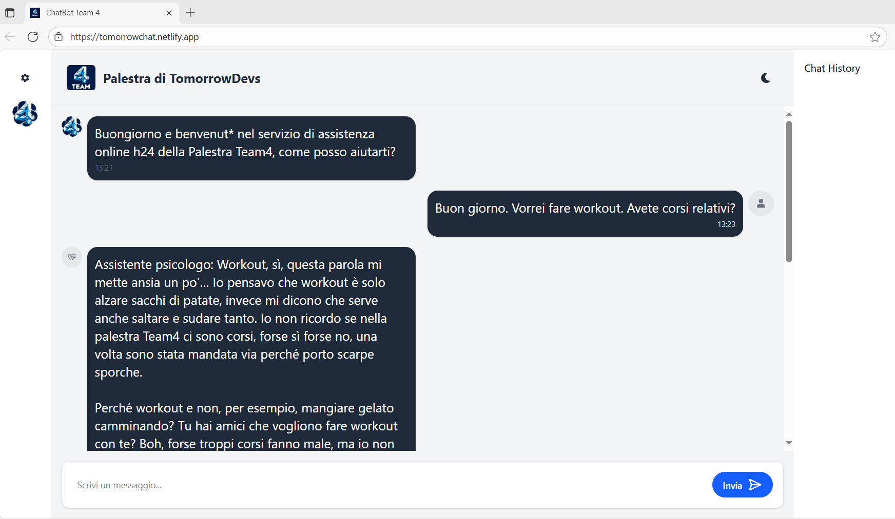
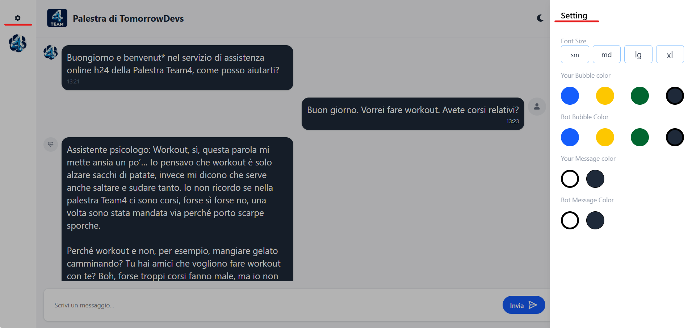
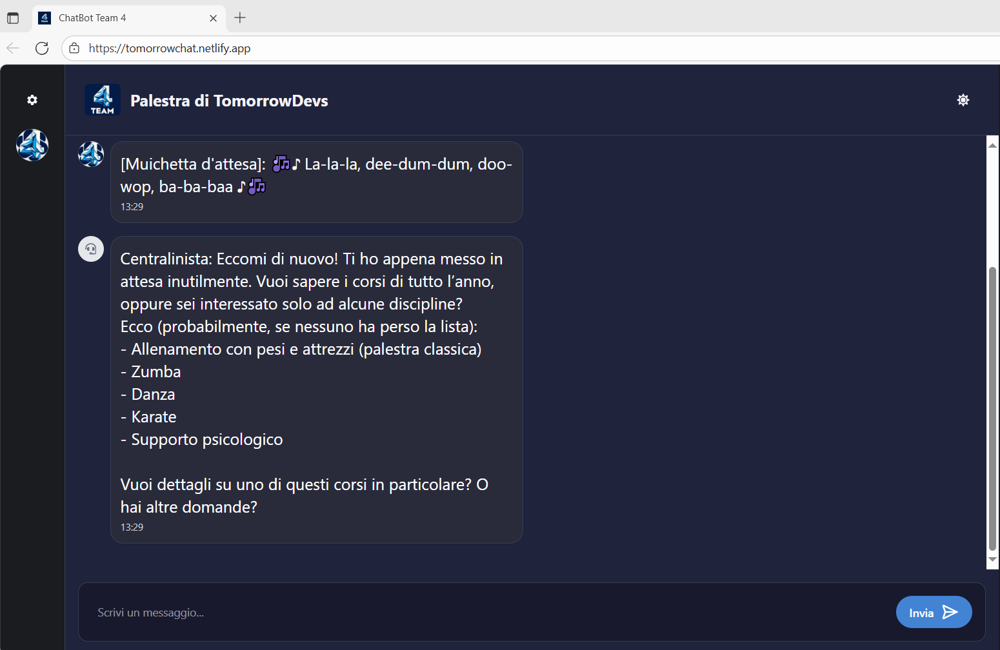

# Table of Contents

---

1. [Project name](#project-name)
2. [General Info](#general-info)
3. [Features](#features)
4. [Screenshot](#screenshot)
5. [Tech Stack](#tech-stack)
6. [Prerequisites](#prerequisites)
7. [Installation Usage](#installation-usage)
8. [Authors](#authors)
9. [License](#license)

## Project name

---

**Team4 Gym – Support Chat**

## General Info

---

A real-time chat application for Team4 Gym's customer support.

### Features

---

* ✅**Interactive chat** between user and bot;
* ✅ **Custom bot avatars**  
* ✅ **Light/Dark theme** with toggle  
* ✅ **Responsive UI** for both desktop and mobile
* ✅ **Settings** panel:
  - 🎛️ **Change chat bubble colors** (user and bot)
  - 🎨 **Change text color** inside bubbles
  - 🔠 **Adjust text size** (S / M / L / XL)
### Screenshot

---

* 
* 
* 

## Tech Stack

---

* ⚛️ **React**
* ⚡ **Vite**
* 🎨 **Tailwind CSS**
* 🖼️ **React Icons**

## Prerequisites

---

- [Git](https://git-scm.com/) – to clone the repository
- [Node.js](https://nodejs.org/) (v18+) – to run the project
- [npm](https://www.npmjs.com/) – for package management

## Installation Usage

---

- git clone https://github.com/francescoup/tomorrow-chat.git
- cd tomorrow-chat
- npm install
- npm run dev

### Examples

---

**Live Demo:** [DEMO](https://tomorrowchat.netlify.app/)

## Authors

---

- Cristian
- Francesco
- Margherita
- Michele
- Valentino
- Vincenzo

## License

---

Distributed under the MIT License.
